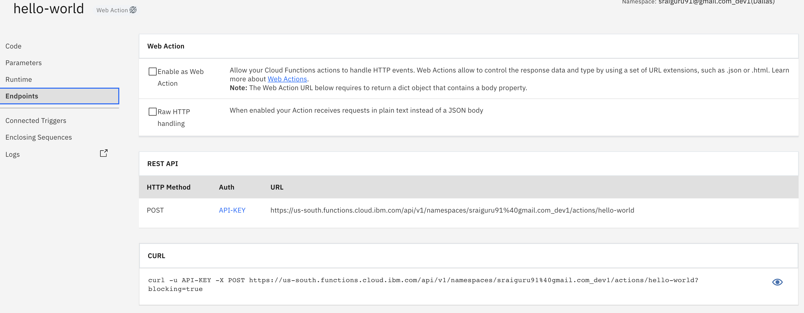
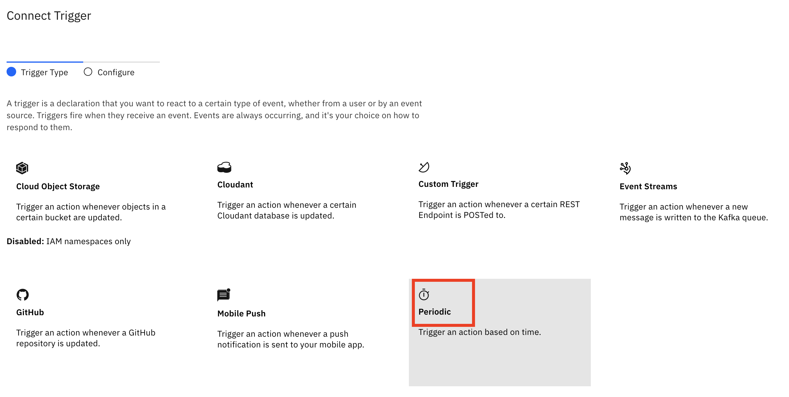
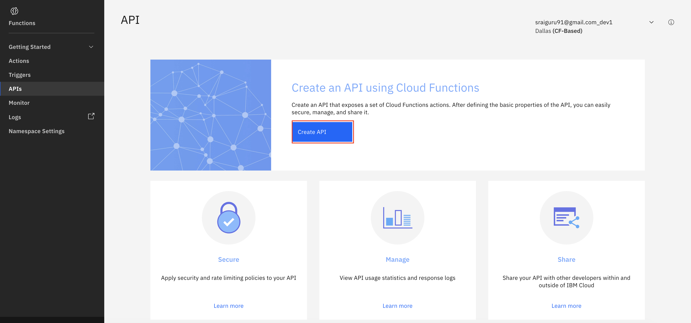
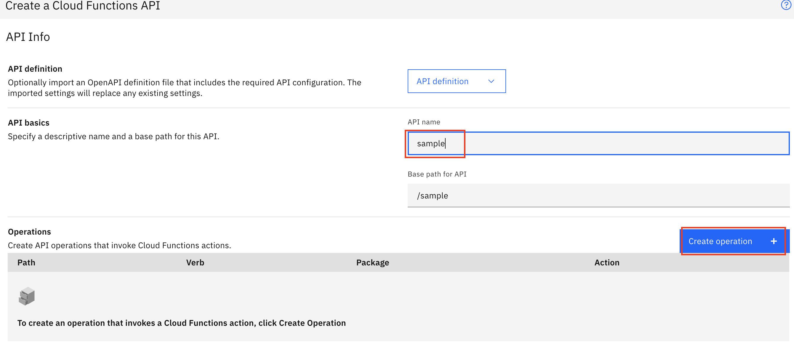
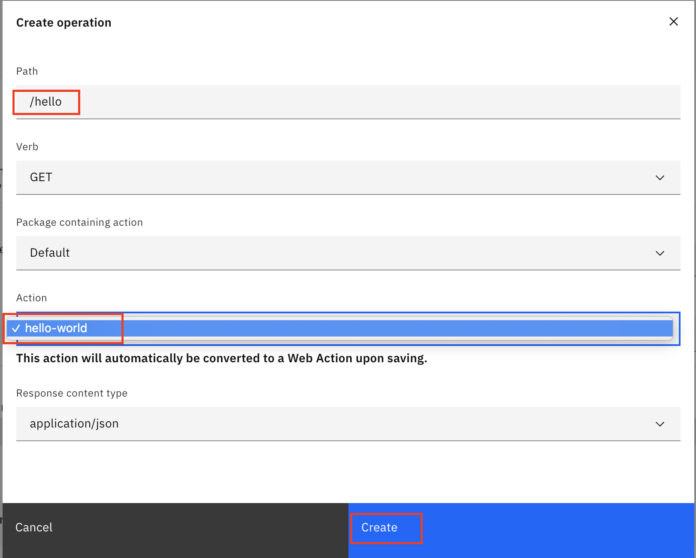
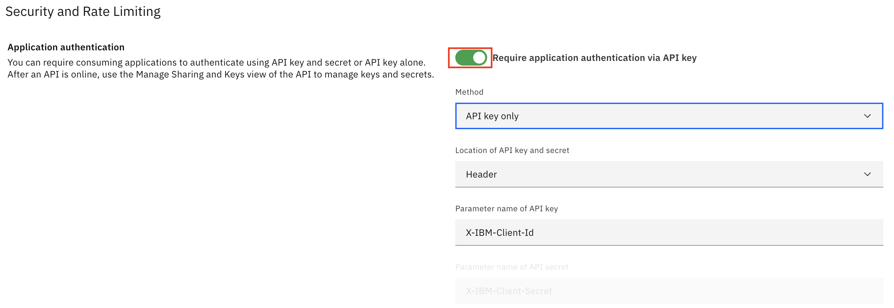
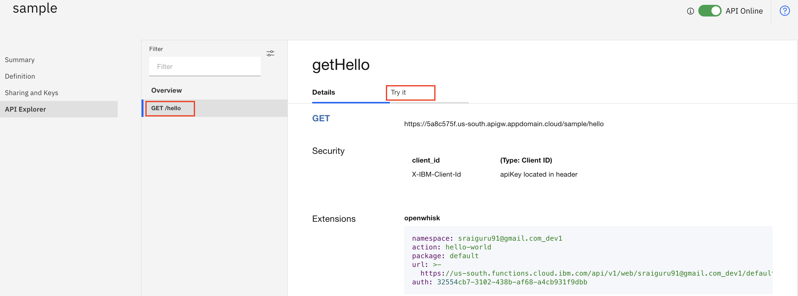
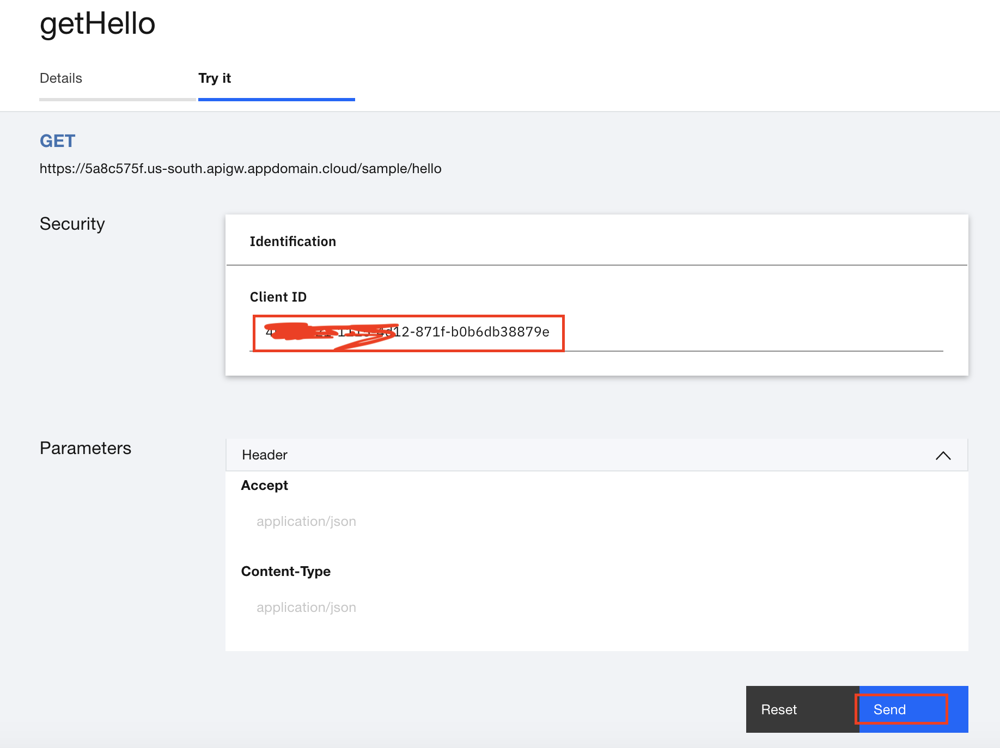

# Serverless and API Gateways - Lab

###  Welcome to this serverless and Cloud API Gateways Lab, where we will be trying out `actions` , `triggers` and exposing & securing actions using `API gateways`


## 1. Creating API Gateways service.

Go to API Gateways service page on IBM Cloud and `Create` a service.

https://cloud.ibm.com/catalog/services/api-gateway

Note: This service is available in Lite plan only.


## 2. Let us create our first function on a NodeJS runtime.

-  Go to -> https://cloud.ibm.com/functions/ and Click on `actions`


-  lets create our first action as below and click on `Create`


-  Lets try out if the action is working now,
-> Go to `Endpoints` on the left bar and copy the CURL command at bottom





and paste in the terminal or prompt.
Alternatively you can also try web-action to check it. You will see `hello world` message in the JSON response.


## 3 Enabling actions as a `trigger` [Optional]
Click on `connected triggers` on the left bar and select `Add Trigger` to quickly create an event based trigger.


There are many ways to trigger based on an event type, but we will choose a time-based `periodic` trigger


a. Provide a `trigger name` say `sample` a cron for every minute and click on `Create & Connect`


Once create this trigger will be invoked every minute (as per the rule) and we can see the same in Function Dashboard
[Functions Dashboard](https://cloud.ibm.com/functions/dashboard)


## 4. Exposing this function as a secure API & manage it using API Gateways
We need to now expose our actions as API and also secure them
-> lets go to API gateways service which we have created already earlier.
[API Management Service](https://cloud.ibm.com/functions/apimanagement)

Click on `Create API`



Enter `API Name` say, `sample` and Click on `Create Operation`



Provide a `Path` say `hello`, select the action `hello-world` you created earlier and Click on `Create`  



#### Securing the API Endpoint
Once we have now created an API GET /hello we need to now secure it.

- Toggle the `Require authentication via API Key`



- Scroll down and click on `Save`. It will take you to `Summary` page of the API.
Wherein, we can see the API link, status etc.
- Go to `Sharing & Keys` on the left and Click on `Create API Key`


- Paste this label `X-IBM-Client-Id` and `Create` a Key
Note: Keep a note of the `generated` API Key.


Now lets try using the get /Hello API with the apikey
- Go to `API Explorer` and click on `GET /hello` and `Try it`
This is the swagger which is provided for testing your API.



- Paste the `X-IBM-Client-Id` Key value which was noted earlier and click on `Send`.



- You should see a sample response below.


## 5. [Practice] with variables / parameters

- [Prerequisite] Create a new action hello world action on NodeJS


- Change the function `message` to parse the input parameters

```console
function main(msg) {
	return { message: "Hello, you are " + msg.name + " from " + msg.place + " and you have received " + msg.material + " as your relief materials" };
}

```

- Change the parameters accordingly in the `Invoke with parameters` and `Invoke` the function

```console
{
    "name":"Saurav",
    "place":"Bangalore",
    "material":"Biscuits"
}
```

## 6. Additional lab using API connect

[create & manage APIs using API Connect](https://developer.ibm.com/tutorials/create-and-manage-apis-using-api-connect/)
